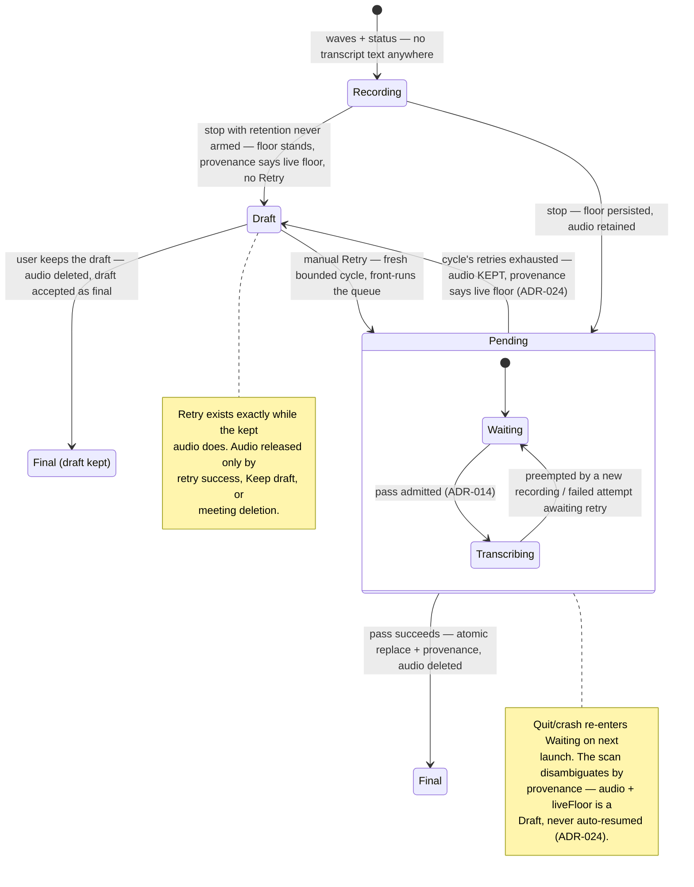

# Final Transcript Quality v2 & Final-Only Transcript UX Specification

**Status:** Draft

## Problem Statement

SP-005 shipped the final re-transcription pass, and the first real-world comparison exposed where it still falls short. On 2026-08-04 the user recorded the **same meeting** with Echo and with Notion; Notion's transcript was clearly better — not because of its model, but because Echo's final transcript still contains failure classes a reader immediately recognizes as "the app doing a bad job":

1. **Hallucination trains over silence.** Within 30-second decode windows containing real speech somewhere, silent stretches decode to invented text — "Gracias." appeared 25+ times across both channels, "I am sorry" ×6, "Esto no funciona" ×9, plus Whisper's YouTube-training artifacts ("Subtitles by the Amara.org community", "I think that's it for this video… Bye!"). The per-segment noise/boilerplate filters are defeated because they judge each segment against energy statistics computed over the **whole window**, and the pinned WhisperKit's no-speech probability is dead code (SP-005 already documented this) — so a hallucination inside a window that has speech elsewhere sails through.
2. **Repetition loops kept after exhausted retries.** The temperature-fallback mechanism re-decodes flagged windows, but when every retry still fails the quality thresholds, the last (worst) attempt is kept anyway — producing 30-second segments of "eh, eh, eh…" and 40-fold "el, ah, el, ah…" loops in the persisted transcript.
3. **Covert translation.** The final pass's language tracker defaults to English and requires a two-window streak to switch. The microphone channel is dominated by short backchannel ("Mm-hmm", "Okay") that detects as English, so the tracker locks to English — and the user's Spanish sentences are then *translated* by Whisper into approximate English instead of transcribed. The actual words are unrecoverable downstream.
4. **Broken timestamps.** Segments that begin inside the decode window's trailing silence pad are clamped only on their end time, producing segments with `end < start` and zero-duration duplicates.
5. **The live transcript is the app's worst output, and it is the first thing users see.** During a meeting, the dashboard shows the live pipeline's 1–12 s chunks — precisely the output SP-005 declared "orientative." Users judge the app by it anyway.

Two structural gaps keep these problems invisible and hard to fix: **no per-meeting provenance** (a pass that silently fell back from the 947 MB model to the live turbo model looks identical to a full-tier pass — nothing records which model actually produced a transcript), and **no iteration loop** (retained audio is deleted on pass success, so a real meeting that exposed a defect cannot be replayed against a fix; the 2026-08-04 meeting's audio is already gone).

Additionally, the persisted transcript schema carries dead weight: every segment encodes `"speaker": {"teammates": {}}` — Swift's synthesized enum encoding — which is fully derivable from `channel` and adds noise to every export and every downstream consumer.

## Success Criteria

- **The user never sees a live transcript.** During a recording, no live or partial transcript text is visible anywhere in the app — dashboard, meeting detail, footer, menu bar popover, island. The recording view shows live audio waves and a clear "recording" status instead. After stop, the meeting shows an honest "Transcribing…" state with real progress while its pass decodes — and an honest *waiting* state (never fake progress) while the pass is queued, deferred behind a newer recording, or resuming after a relaunch. Every pending meeting eventually resolves to exactly one of: the final transcript, or the draft-labeled floor — from which a manual Retry can start a fresh cycle (ADR-024).
- **No text over silence, fixture-verified on a real meeting.** On the acceptance fixtures (see Testing Decisions), the final transcript contains zero hallucination-class segments over spans where nobody speaks. SP-005's containment criterion, now verified against the real-meeting failure classes above (the three excerpt fixtures from the 2026-08-04 meeting reproduce them).
- **Nothing is better than garbage.** A decode window whose every retry still fails the model's own quality thresholds contributes *no* text — an honest gap — rather than the last failed attempt. No run of 3+ consecutive near-identical segments survives to the persisted transcript.
- **Spanish comes out in Spanish.** On mixed es/en fixtures where the microphone channel is dominated by backchannel, full Spanish sentences transcribe in Spanish — no whole-channel English lock, no covert translation.
- **No malformed segments.** The persisted final transcript contains no segment with `end < start`, no zero-duration duplicates, and no segment whose start lies beyond its decode window's real audio.
- **The transcript reads as a conversation, not a chunk log.** The transcript view renders consecutive same-speaker segments merged into utterances with a time range and speaker label; standalone backchannel does not interrupt the other speaker's paragraphs. The summary pipeline receives the merged, backchannel-filtered form.
- **Every meeting records its provenance.** `meta.json` records which speech model (and tier/fallback) produced the persisted transcript, whether it is live-floor or final-pass output, and which summary model wrote the notes. A degraded pass is distinguishable from a full-tier pass after the fact.
- **A real meeting is replayable in development.** A DEBUG-build option retains the meeting's audio after a successful pass, and a developer harness can re-run the final pass over that audio to compare pipeline variants. Release builds are unaffected: retention stays temporary and privacy semantics unchanged.
- **The floor never weakens — and a failed meeting stays recoverable.** The SP-005 guarantees stand: live transcript persisted at stop, atomic replace only on success, bounded retries within a cycle, recording preempts; retained audio remains the pending marker, now disambiguated from the terminal draft by recorded provenance (ADR-024). A terminal pass failure shows the live transcript honestly labeled as a draft — the label survives relaunch (it keys on recorded provenance) — **with the meeting's audio kept and a manual Retry** that runs a fresh bounded pass cycle whenever the user chooses (ADR-024, amending ADR-016). The audio is released only by a later successful pass, by deleting the meeting, or by the user explicitly keeping the draft.
- **Old meetings keep opening.** Existing persisted transcripts (current schema) load unchanged; the schema cleanup is backward-tolerant.

## User Stories

1. As a user in a meeting, I want the app to show that it is capturing audio (live waves, recording status) without showing me raw transcript text, so that I am never confronted with an intermediate transcript that misrepresents the app's final quality.
2. As a user who just stopped a recording, I want the meeting to show "Transcribing…" with honest progress until the final transcript is ready, so that I know the app is working and roughly how long it will take.
3. As a user opening a finished meeting, I want to see only the final transcript, so that everything I read is the app's best output.
4. As a user whose final pass failed terminally, I want the meeting to show the live transcript labeled as a draft with a **Retry** that re-runs the final pass from the meeting's kept audio — after the automatic bounded retries already ran without me — so that a finalization problem never costs me the meeting, and recovering it stays in my hands (ADR-024).
5. As a user reading the final transcript, I want silent stretches to produce no text at all, so that I never see invented phrases ("Gracias", "Thanks for watching") attributed to me or my teammates.
6. As a user whose meeting had noisy or unintelligible stretches, I want those stretches to appear as honest gaps rather than repeated-phrase loops, so that the transcript never fills bad audio with garbage.
7. As a user who speaks Spanish in a meeting where I mostly listen and backchannel, I want my Spanish sentences transcribed in Spanish, so that my actual words — not a machine translation of them — are what the transcript and summary contain.
8. As a user reading the transcript, I want consecutive lines from the same speaker merged into paragraphs with a time range, so that the conversation reads like a conversation instead of a log of decoder chunks.
9. As a user reading the transcript, I want my standalone acknowledgments ("Mm-hmm", "Okay") kept out of the way of the other speaker's paragraphs, so that the flow of what was actually said stays readable.
10. As a user relying on the meeting summary, I want it grounded in the merged, cleaned transcript, so that action items and decisions come from real sentences rather than fragments and backchannel noise.
11. As the product owner, I want `meta.json` to record which transcript model ran (and whether the pass fell back to the live model), whether the persisted transcript is final or live-floor, and which summary model generated the notes, so that a quality complaint about any meeting can be diagnosed from its own metadata.
12. As a developer, I want a DEBUG option that keeps a meeting's retained audio after a successful pass, so that a real meeting that exposed a transcription defect becomes a reusable fixture.
13. As a developer, I want to re-run the final pass over retained audio outside the app flow and diff the resulting segments, so that every anti-hallucination change is measured against real audio before it ships.
14. As a user with existing meetings, I want them to keep opening and rendering exactly as before after the app updates, so that the schema cleanup never costs me history.
15. As a developer consuming the transcript JSON, I want each segment's speaker encoded as a plain value derived from one source of truth, so that exports stop carrying empty structural noise (`"speaker": {"teammates": {}}`).

## Non-Functional Requirements

> Stakeholder-reviewable language. Significant technical decisions surfaced during refinement become ADRs; implementation detail defers to build.

### Performance

- Removing the live transcript view removes work: partial-preview decoding (a UI-only path) is deleted outright, not hidden — recording sessions do strictly less transcription work than today.
- The additional final-pass discipline (per-segment evidence checks, language re-decodes on flagged windows) keeps the pass completing in well under the meeting's own duration on every supported machine; the honest-progress requirement from SP-005 (single fraction source, always advancing) is unchanged.
- Utterance merging and backchannel filtering are lightweight presentation/derivation steps; opening a meeting stays instant.

### Reliability

- The SP-005 floor semantics stand with one amendment: live transcript persisted at stop, atomic replacement only on success, bounded retries within a cycle, recording preempting all post-meeting model work. Retained-audio presence remains the pending marker, but is no longer the *sole* state bit: terminal convergence keeps the audio (ADR-024), so the launch scan disambiguates by recorded provenance — audio with no transcript provenance is pending (auto-resume); audio with `liveFloor` is a terminal draft, never auto-resumed; audio with `finalPass` is the orphan of a crashed success cleanup, swept.
- **The live pipeline keeps running during recording — it is load-bearing, just invisible.** It produces the floor transcript persisted at stop (ADR-016), it is the model the floor RAM tier's final pass reuses (ADR-015), and its finalized-chunk gate decisions feed the input-health classifier (ADR-006). Only the partial-preview decode path — verified UI-only: its sole consumers are `RecordingState`'s partial plumbing and the dashboard footer — is deleted. Hiding the live transcript must never be "optimized" into stopping live transcription.
- The pending-meeting state must always resolve, on every path: pass decoding → "Transcribing…" with the single ADR-007 fraction; pass queued, deferred behind a newer recording's post-stop pipeline, or awaiting launch-resume → an honest waiting state; success → final transcript; terminal convergence → draft-labeled floor with Retry. The draft is a *resting* state, not a stuck one: Retry re-enters the pending states and resolves again. A quit or crash mid-pass resolves via ADR-016's directory-scan resume — the meeting shows waiting again on next launch, never a stuck percentage. No meeting is ever stuck showing neither transcript nor state.
- **While pending, retries are automatic; from the draft, Retry is manual (ADR-024).** While a pending meeting's cycle runs, ADR-016's bounded retries and launch resume act without the user. Terminal convergence keeps the audio and hands control to the user: the draft's Retry re-enqueues the pass with a fresh bounded attempt budget, front-running the deferred queue (the SP-005 user-request discipline); recording still preempts; a cycle that converges again returns to the draft with Retry still available. Nothing loops automatically — the user paces every new cycle.
- The Retry affordance exists exactly while the meeting's retained audio does. A draft without audio — retention never armed (writer failure, disabled mid-session), or the user chose "Keep draft" — offers no Retry: there is nothing to re-decode. The kept audio is deleted on a later successful pass, on meeting deletion, or on "Keep draft" (accepting the draft as final) — no other path deletes it.
- A meeting whose retention never armed can never be finalized: it resolves directly to the draft-labeled floor, without Retry — the honest degradation SP-005 already required, now visibly labeled via provenance rather than silently passing as final.
- A final pass whose disciplined output is empty replaces the transcript only when the energy evidence itself says nobody spoke; if speech regions existed and every segment was dropped, the pass fails and the floor stands (ADR-019's empty-output guard) — a filter bug can never silently erase a good transcript.
- Ordering of the new filters is fixed: ADR-019's decode-discipline (rejection, per-segment evidence, run collapse, tail-pad hygiene) runs per channel during pass assembly, **before** the ADR-003 batch dedup over the complete set — run collapse keeps a timing representative, so collapsed Team runs remain matchable dedup anchors. Presentation merging (ADR-021) happens strictly after persistence, at render/summary time.
- Summary sequencing is unchanged from SP-005 — the stop path already awaits the pass before any summary work, and backfill already respects the pending marker. The only summary-side change is its *input*: the merged, backchannel-filtered derivation (ADR-021), whose utterances preserve their constituent segment IDs so evidence grounding keeps resolving to persisted segments.
- Provenance is written in the same step as the artifact it describes (transcript replace, terminal convergence, summary attach). It stays display/diagnostics-only with one explicitly sanctioned exception: the transcript-source field is the bit that disambiguates terminal drafts from pending meetings in the launch scan (ADR-024; ADR-022 amended accordingly). Nothing else schedules off it.
- Transcript decoding is backward-tolerant: both the legacy speaker encoding and the plain-string form load; meetings written by older versions never fail to open, with no migration and no schemaVersion bump (ADR-023). The accepted cost is the reverse direction: pre-SP-007 builds cannot open post-SP-007 transcripts — no downgrade path is promised. Provenance fields are additive and optional — their absence (old meetings) renders as "unknown," never as an error.
- Presentation merging never alters persisted data: the persisted transcript remains the segment-level record (timestamps, channels, attribution) that dedup, Q&A, and the accuracy harness consume (ADR-021).

### Privacy (local-first)

- Release builds: retention is deleted on pass success, on meeting deletion, or when the user keeps the draft; nothing ever leaves the device. **One deliberate exception to SP-005's temporariness** (ADR-024, user-accepted): a terminally failed meeting's audio stays on disk **until the user acts** — retries to success, keeps the draft, or deletes the meeting. It stays inside the meeting's own folder (so meeting deletion always removes it) and is bounded per meeting (compressed speech-rate audio, ADR-013); only the user's own inaction extends it.
- The retained-audio keep flag exists **only in DEBUG builds**, off by default, and its output stays inside Echo's data folder. Release builds contain no code path that retains audio past the pass.
- Provenance metadata contains model names and tiers only — never audio, transcript text, or user content.

### Quality Safeguards

- "Nothing is better than garbage" is the decode discipline: every filter decision errs toward dropping doubtful text in the final transcript, because the final pass — unlike the live path — has no obligation to show something immediately and always leaves an honest gap instead.
- The three real-meeting failure excerpts (hallucination train over silence, unintelligible repetition stretch, covert-translation span — the Evidence base table) are encoded as acceptance fixtures with expected outcomes, so this spec's claims are verified against the exact evidence that motivated it.
- Model naming honesty (SP-005 register) extends to provenance: the recorded model names are the real checkpoint names, and a fallback pass is recorded as a fallback.
- All user-facing copy is in English (project rule).

## Related ADRs

- [ADR-019](../adrs/ADR-019-final-pass-discard-over-keep.md) — The final pass discards decode output that lacks evidence: rejection after exhausted fallback, per-segment energy evidence, run collapse, tail-pad hygiene; empty output counts as success only where the evidence says nobody spoke; filters run per channel before ADR-003 batch dedup
- [ADR-020](../adrs/ADR-020-voiced-evidence-language-decisions.md) — Final-pass language decided per window on voiced evidence (no session lock); session language only as fallback for undetectable windows; alternate-whitelist-language re-decode as the backstop for quality-flagged windows; prompt chain resets on language change
- [ADR-021](../adrs/ADR-021-derived-utterance-merge.md) — Utterance merging and backchannel filtering are pure derivations at render/summary time, never persisted; utterances preserve constituent segment IDs (resolves open question 2)
- [ADR-022](../adrs/ADR-022-transcript-provenance-in-meta.md) — Provenance recorded in meta.json as additive optional fields, written with the artifact each describes, display/diagnostics-only with one explicitly sanctioned scheduling use: the transcript-source bit that disambiguates pending vs. terminal draft in the launch scan (ADR-024). Also what makes the Draft badge survive relaunch
- [ADR-023](../adrs/ADR-023-speaker-plain-string-tolerant-decoding.md) — Speaker persists as a plain string with tolerant decoding; the schema evolves additively without a version bump (no downgrade path — accepted)
- [ADR-024](../adrs/ADR-024-terminal-draft-keeps-audio-manual-retry.md) — Terminal finalization failure keeps the retained audio and offers a manual Retry (fresh bounded cycle, user-paced); audio released by retry success, meeting deletion, or "Keep draft"; the launch scan disambiguates pending vs. terminal draft via the provenance transcript-source bit. Amends ADR-016's converged-failure clause and ADR-013's deletion-on-convergence path; user-accepted privacy trade-off

Inherited constraints (accepted before this spec, complied with): [ADR-003](../adrs/ADR-003-asymmetric-keep-on-doubt-dedup.md) (batch dedup over the complete final set, keep-on-doubt — ADR-019's opposite default is scoped to decoder-output evidence and deliberately does not touch dedup), [ADR-007](../adrs/ADR-007-honest-download-progress.md) (single-source progress — the "Transcribing…" fraction), [ADR-013](../adrs/ADR-013-temporary-audio-retention-for-final-pass.md) (bounded temporary retention — amended by ADR-024 for the terminal-draft state; the DEBUG keep flag remains a separate scoped development exception documented in Further Notes), [ADR-014](../adrs/ADR-014-serial-heavyweight-model-admission.md) (serial admission, recording preempts — manual Retry passes are admitted like any other pass), [ADR-015](../adrs/ADR-015-final-pass-model-ram-tiering.md) (RAM tiering — provenance records the tier, never changes it), [ADR-016](../adrs/ADR-016-live-transcript-floor-atomic-replace.md) (floor / atomic replace / retained-audio pending marker — its converged-failure-deletes-audio clause is superseded by ADR-024; everything else stands).

## Testing Decisions

SP-005's register carries forward wholesale and is not restated: assert external observable behavior; deterministic logic in committed fast tests, everything needing audio behind the acceptance gate with **local fixtures never in the repo**; the runner gotchas stand (`ECHO_ACCEPTANCE=1` must be spelled `TEST_RUNNER_ECHO_ACCEPTANCE=1` through xcodebuild; acceptance suites `.serialized` with parallel testing disabled; unit runs work around the Fixtures build collision by moving `EchoTests/Fixtures` aside and using `-only-testing`). This spec's additions, fastest-first:

1. **Pure tables (no I/O)** — the ModelDownloadProgressTests / CaptureGapTests style, extending the existing SP-005 suites (`SpeechRegionSelectorTests`, `FinalPassLanguageTests`, `FinalPassWindowPlanTests` are the homes or the prior art):
   - **Per-segment evidence** (ADR-019): synthetic probe/sample series with speech in one half of a window — a segment spanning the voiced span keeps, a segment over the in-window silence drops, whatever the whole-window stats say. The exact failure geometry of the 2026-08-04 hallucination train, as a table.
   - **Rejection after exhausted fallback**: segment quality metrics (avgLogprob, compressionRatio) in → kept text out; the row where every attempt fails asserts an empty window, not the last attempt.
   - **Run collapse**: normalization and near-identity rows ("el, ah, el, ah…" ×40; "eh," ×N; case/punctuation variants), run-length boundaries (2 survives, 3+ collapses), and the representative's timestamps surviving as the dedup timing anchor.
   - **Tail-pad hygiene**: window end + raw segment times in → clamped / dropped out; the `end < start` construction from the real meeting is a row that must become impossible.
   - **Language decisions** (ADR-020): detection results + quality flags in → decode language and A/B verdict out, including the motivating row (backchannel-dominated channel, full Spanish window decodes as Spanish) and chain-reset on language change.
   - **Utterance merge + backchannel filter** (ADR-021): segments in → utterances out; inputs never mutated; constituent segment IDs preserved; standalone backchannel filtered without swallowing real short answers — the classification list (open question 1) is table-driven so tuning it is editing rows.
   - **Pending-display resolution**: build the meeting's displayed state as a pure function (finalization machine state + provenance + retained-audio presence in → exactly one of recording / waiting / transcribing / draft-with-Retry / draft-without-Retry / final) and table the "always resolves" criterion over event sequences — stop→pass→success, preempt-mid-pass→waiting, failed-attempt→auto-retry, cycle-exhausted→draft-with-Retry, manual-Retry→waiting→transcribing (fresh attempt budget, front of queue), second-convergence→draft-with-Retry again, Keep-draft→draft-without-Retry, retention-never-armed→draft-without-Retry, relaunch with audio+liveFloor→draft (never auto-resumed) (the `FinalizationLifecycleTests` machine style; the terminal re-admission rule changes — a manual Retry must clear the machine's terminal exclusion for that meeting).
2. **Dedup composition (pure, ADR-003)** — new rows in `FinalDedupCompositionTests`: run collapse before batch dedup (a collapsed Team run still catches its mic echo via the surviving representative; a mic run collapsed to one candidate still gets suppressed when it is bleed).
3. **Store mechanics (real-FS temp roots, `MeetingStoreTests` style)** — tolerant decoding from inline JSON fixtures: legacy object speaker form, plain-string form, unknown speaker string → channel-derived default; meta without provenance → "unknown," never an error; `replaceTranscript` writes the string form and the transcript-provenance fields in the same meta re-derivation step ADR-016 fixed; **terminal convergence writes live-floor provenance and leaves the retained audio untouched** (ADR-024 — the named-target deletion assertion inverts for this path); the launch scan's three-way classification (audio + no transcript provenance → pending; audio + liveFloor → terminal draft, excluded from auto-resume; audio + finalPass → orphan, swept); retry success deletes exactly this meeting's audio; Keep-draft deletes the audio and leaves transcript + provenance untouched; meeting deletion removes kept audio with the folder; an untouched old meeting's bytes stay byte-identical after a read (the SPEC-03 golden discipline).
4. **Deletion, not suppression** — the partial-preview path is removed at the seams (pipeline, `RecordingState`, footer), so its absence is compile-enforced rather than asserted; the existing gate-diagnostics suites re-run unchanged as the guard that live-path behavior didn't move (partial gate checks were deliberately never recorded — ADR-006 — so no diagnostic baseline can shift).
5. **Acceptance (TEST_RUNNER_ECHO_ACCEPTANCE=1, `.serialized`, real models, local fixtures)** — the executable definition of done: the three real-meeting excerpt classes (Further Notes table) as local fixtures once the DEBUG keep flag produces replayable audio — hallucination-train span yields zero segments, unintelligible stretch yields an honest gap, covert-translation span yields Spanish; SP-005's WER, two-sided containment, and echo-fixture dedup-parity suites re-run so the discard discipline's cost is *measured* (no regression on clean fixtures beyond normal variance), never assumed. Suites skip with a pointer when fixtures are absent (the `AECAcceptanceTests` pattern).
6. **The developer harness is the acceptance vehicle** (user story 13): a DEBUG entry that runs the final pass over retained fixture audio and diffs segment sets between pipeline variants — its code repo-tested, its inputs local-only.

**What stays manual:** an eyeball sweep that no transcript text appears anywhere during recording (dashboard, detail, footer, menu bar popover, island); one forced terminal failure verifying the Draft badge with Retry, its relaunch survival *without* auto-resume, and one manual Retry driven to success on hardware (audio deleted, badge cleared); one real quit-mid-pass → relaunch → waiting → final on hardware.

## Out of Scope

- **Live-pipeline decode improvements** (language hysteresis in live chunks, overlap at forced cuts, live prompt conditioning) — the live transcript remains the invisible safety floor; improving its decode quality is still deferred (BRN-004 ideas 4–6). Deleting the partial-preview path is in scope (it is removal, not decode work).
- **Changing the live or final-pass model checkpoints** — the RAM tiering and model set from SP-005/ADR-015 stand; this spec verifies and records what runs, it doesn't change it.
- **Vocabulary/name-glossary conditioning, LLM post-correction, SpeechAnalyzer ensemble** (BRN-004 ideas 4, 8, 9) — still future work.
- **Speaker diarization** (SpeakerKit, per-teammate speakers) — the schema cleanup leaves room for it, but no diarization behavior changes.
- **Editing the transcript** (user corrections) — read-only as today.
- **Re-finalizing meetings that already finalized successfully** — once a pass has succeeded and its audio is deleted, the final transcript is final. (Manual Retry from the draft state is now **in** scope — ADR-024; this exclusion covers only meetings whose audio is gone: successful passes, kept drafts, and retention-never-armed meetings.)
- **Exposing provenance in the UI** — recorded in `meta.json` in this spec; a user-visible surface is a follow-up (open question 3).

## Open Questions

| #   | Question                                                                                                                                                  | Owner | Status |
| --- | --------------------------------------------------------------------------------------------------------------------------------------------------------- | ----- | ------ |
| 1   | Backchannel definition for filtering/merging: the exact token set and length bounds that classify a segment as standalone backchannel (build-time list, seeded from the real meeting's data). | Build | Open — resolve during build |
| 2   | Whether merged utterances are derived at render time or persisted alongside segments (architecture call; presentation merging must not alter the persisted segment record either way).          | Architect | **Resolved — derived at render/summary time, never persisted ([ADR-021](../adrs/ADR-021-derived-utterance-merge.md))** |
| 3   | Whether/where the UI should surface provenance ("Transcribed with…") on the meeting detail — follow-up surface once the metadata exists.                    | Diego | Open |
| 4   | Whether the word-count stat shown during recording (menu bar) stays live-derived or is hidden until the final transcript exists.                            | PM    | Open — resolve during build |
| 5   | Whether the draft state's "Keep draft" action ships (accept the draft as final, delete the kept audio). Included by the Architect on privacy grounds — the user needs a way to end retention without deleting the meeting (ADR-024) — but it is a borderline product surface. | Diego | Open |

## Further Notes

**Evidence base.** The 2026-08-04 meeting (recorded simultaneously by Echo and Notion) is the motivating artifact. Its Echo output was confirmed to be final-pass output (the `end < start` segments carry the tail-pad clamp signature), so every defect above survived SP-005's shipped pipeline. Its audio is already deleted — which is itself the argument for user story 12. The three excerpt classes to encode as fixtures once replayable audio exists:

| Excerpt class | Real-meeting example | Expected after this spec |
|---|---|---|
| Hallucination train over silence | "I am sorry" ×6 at 2 s intervals; "Gracias." with zero duration | No segments emitted on those spans |
| Unintelligible stretch | 30 s window of "eh, eh, eh…"; "el, ah, el, ah…" ×40 | Honest gap (window rejected) |
| Covert translation | User's Spanish rendered as English ("I'll go straight to her and see how she's doing") | Spanish transcription of the actual utterance |

**Why the failures compose.** Each defect feeds the next: the English-locked tracker mis-decodes Spanish windows → low-confidence output → temperature fallback → kept-anyway garbage → window-level stats let it through the filters. Fixing the filters alone leaves the language lock producing plausible-but-wrong English that no energy filter can catch; fixing both is what closes the gap to Notion.

**What "final-only UX" removes, concretely.** The dashboard footer's live partial text, the live-following transcript scroll during recording, and the partial-preview decode path in the transcription pipeline (UI-only, verified against the code: its complete consumer set is the pipeline's partial machinery, `RecordingState`'s partial plumbing, and the dashboard footer — `SummarizationPipeline`'s "partialProse" is an unrelated summary-streaming concept that merely shares the word, leave it alone). The pinned live meeting row stays but its live word count is open question 4 (its ticking clock and REC badge are status, not transcript). Live waves remain as the capture-health signal. Note that during recording `state.segments` still accumulates invisibly — it *is* the floor persisted at stop — so both answers to open question 4 stay cheap.

**The post-stop states, end to end.** Every meeting resolves through exactly one path:

Recording shows waves; Pending shows "Transcribing… %" or the waiting copy; Draft shows the live transcript with the persistent Draft badge (plus Retry while its audio exists); Final shows the final transcript. There is no fifth face — Retry re-enters faces the user already knows.

**Relationship to SP-005.** This spec is SP-005's quality follow-through, not its replacement: the retention mechanism (ADR-013), serial admission (ADR-014), RAM tiering (ADR-015), and floor/atomic-replace semantics (ADR-016) all stand. What changes is the decode discipline inside the pass (evidence granularity, rejection over acceptance, language decisions), the visibility rules of the live output, the metadata a meeting keeps, and the development feedback loop. One SP-005 user story is deliberately superseded: story 9 ("read the live transcript while finalization runs") is retired by the final-only product decision — during the pass the user reads the honest progress state instead, and the pass-duration NFR is what keeps that wait acceptable. One SP-005 success-criterion clause is deliberately amended: "failure never becomes indefinite retention" now has exactly one user-accepted exception — the terminal draft keeps its audio until the user retries to success, keeps the draft, or deletes the meeting (ADR-024, amending ADR-013/ADR-016). SP-005's WER harness decisions (fixtures, `ECHO_ACCEPTANCE`, no fixtures in repo) carry forward and gain the DEBUG-retained real-meeting fixtures as their most valuable input.

**The DEBUG keep flag is a scoped exception to ADR-013, not an amendment.** ADR-013's "no path retains audio indefinitely" governs release builds and is untouched: the flag exists only in DEBUG builds, defaults off, keeps the files inside the meeting's own folder (so meeting deletion still deletes them — retention can never outlive its meeting), and exists solely so a real defect meeting becomes a replayable fixture. It is recorded here rather than in an ADR because it changes no release behavior and no product posture — if anyone proposes shipping it, *that* is the decision needing an ADR.

**Provenance, sketched (build detail defers, the shape doesn't).** Additive optional meta.json fields (ADR-022): the transcript's source (`finalPass` / `liveFloor`), the speech checkpoint that produced it (real checkpoint name, SP-005 naming honesty) with its RAM tier and a served-by-fallback flag, and the summary model that wrote the notes. Each written in the same step as the artifact it describes; absent fields render "unknown." The Draft badge reads `liveFloor`, and the same bit is provenance's one sanctioned scheduling use: it keeps the launch scan from auto-resuming terminal drafts whose audio is now kept (ADR-024). Nothing else schedules off any of it.

**Relationship to the meetings-library redesign.** The 2026-07-17 detail redesign (live partials only in footer, live-following transcript during recording) is partially superseded by this spec's final-only rule: the transcript-text surfaces are removed rather than restyled. The pinned live *meeting row* in the list survives — it is status (title, elapsed, REC badge), not transcript text; only its word count is in question (open question 4).

## References

- [SP-005 — Transcript Accuracy: Final Re-transcription Pass](SP-005-transcript-accuracy.md) — the foundation this spec hardens
- [BRN-004 — Transcript Accuracy Improvement](../brainstorms/BRN-004-transcript-accuracy.md) — the original accuracy brief; measure-first principle
- [ADR-013](../adrs/ADR-013-temporary-audio-retention-for-final-pass.md), [ADR-014](../adrs/ADR-014-serial-heavyweight-model-admission.md), [ADR-015](../adrs/ADR-015-final-pass-model-ram-tiering.md), [ADR-016](../adrs/ADR-016-live-transcript-floor-atomic-replace.md) — accepted constraints this spec operates within
- Key code: `FinalizationPass.swift` (window loop, region selection, language tracker, prompt chain), `TranscriptionPipeline.swift` (segment assembly, noise/boilerplate filters, partial-preview path to delete), `RecordingController.swift` (stop orchestration, pass invocation), `FinalizationCoordinator.swift` (admission machine, bounded retries, the observable states the pending display maps from), `TranscriptDedup.swift` (ADR-003 batch dedup the new filters must precede), `MeetingStore.swift` / `MeetingModels.swift` (meta.json, transcript schema), `TranscriptModels.swift` (Speaker encoding), `DashboardView.swift` / `MenuBarView.swift` (live-transcript surfaces to remove)
- 2026-08-04 comparison transcripts (Echo `transcript.json` vs Notion export) — session evidence, local only
